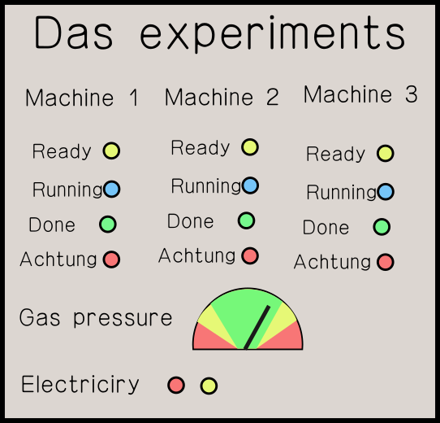

# General Gameplay

This document describes the overarching gameplay concept. It is the plan for
the alpha release of the game. Later on there may be additional maps and
gamemodes.

## Win Conditions (not final)

Spies:

* The spies kill all of the other players.
* A machine is sabotaged to completely break or kill all players.

Scientists:

* All of the main tasks are completed.
* All spies are removed from the game by voting in meetings.

## The mind game

The core idea of the gameplay is that there are two teams: one larger team and
a small team. Only the small team knows who is in which team and while they are
trying to kill the others, the large team tries to find out which players are
in the small team and trying to kill them.

### Kill mechanics

Whenever a traitor is within a small enough distance from a player of the main
team, that traitor can instantly kill the other player.

Killing is done with a gun that may be disguised as a common item like an
umbrella or a pen. The gun needs to be reloaded after every kill, which takes
some time and is obviously viewable by other people in the vicinity.

If you carry an item, you can't kill (see task system).

### Meetings (few questions remain)

Meetings are parts of the game where all remaining players have the opportunity
to discuss their suspicions and ultimately vote for one player to be removed
from the game. As the main team has more players, they will try to select the
spies here, while they should pretend to be on the main team as well and not
draw suspicion on them, as they cannot win a vote just by themselves.

Players can start a meeting by interacting with an intercom placed in the map.
There are multiple intercoms in the map. When a meeting is called, the screen
fades to black and a short cutscene of everyone walking into the meeting room
plays. Now, after the discussion has taken place, all players get to vote on
who should be removed from the game. It is an option to vote that no one gets
removed. After everyone voted or after a timeout the result of the vote is
shown and the game resumes.

## Additional gameplay: Tasks and Sabotages

In between meetings the players get assigned tasks to complete. This gives them
something to do as well as an alternative win condition.

### Map mechanics

The main team has a number of main experiments to complete. That number depends
on the number of players and can also be adjusted manually before starting a
game. Each of these experiments requires other tasks to be completed first to
be started. These prerequisite tasks will either output an item that is needed
for that task or have an output value that needs to be within an acceptable
range (maintenance tasks). These tasks can have dependencies themselves,
creating a dependency chain that needs to done in the right order, ending with
the main task.

All tasks are shared, meaning every player can do every task (main tasks as
well as prerequisite tasks). Spies can also complete any task, counting towards
the main team's goal. To organize the players there will be an initial
assignment of tasks for every player, but it is only a voluntary guideline and
can be disregarded. If a player dies, their share of tasks will have to be done
by the remaining players.

Imposters can do tasks badly, break progression, steal resulting items from
tasks

There should be a display that is shown at one or more points in the map. It
shows the progression of all the tasks, and where tasks have gone wrong. Draft:

The machines (Machine [1-3]) correspond to main tasks with the lights below
indicating their current status. The elements below show the status of
maintenance tasks.

### Items

Items are created by doing tasks, and are destroyed when they are used up by
other tasks. Spies can steal an item from the output of a task, forcing the
scientists to redo that task.

One person can carry one item at once to move it from one task to another. They
can put it down anywhere in the map or in a task, but only if that task
requires that item.

Items on the ground can be picked up by players in range.

### Maintenance tasks

Maintenance tasks cannot be "started" or "completed", they are always running
and continuously emit a value. That value fluctuates randomly over time and can
be adjusted by settings at that task. The maintenance task has an acceptance
interval associated with it. Machines that depend on a maintenance task can
only run while the output value is within that accepted interval. Two machines
that depend on a maintenance task cannot require different acceptance ranges.

Players will have to regularly adjust the settings for the output to stay
accepted. Spies can deliberately misconfigure the task, requiring others to fix
it again. If the value moves outside of the accepted range, any tasks dependent
on it that are currently running will be cancelled, deleting any input
ingredients.

### Tasks (not final)

 2. Chemicals storages - pick up the chemicals from the lists and take them to
    the lab(different chemicals can be in different storage rooms, which one is
    needed in a specific round could be randomized.)
 2. Equipment storage - pick up lab equipment for the experiments
 3. Prepare a solution - mix together two chemicals slowly (requires 1. and
    2.).Multiple types of mixing could be done:- If mixed too fast, the test
    tube explodes and you have to bring the ingredients again- You can mix the
    stuff together but have to wait until the reaction is over (color change?).
    If waiting too long, the task fails.
 4. Start up the machine for the experiment - press buttons until the machine
    turns on(Multiple experimental machines could be available)
 5. Begin experiment - bring the solution to the machine and press start, and
    the experiment begins (requires 3. and 4.)
 6. Pick up the printout of the experiment results (maybe 2 minutes after 5.).
 7. Take the experimental results to the office, and stamp it with the stamping
    machine (after 6.)
 8. Unlock the tube post room - two people simultaneously needs to turn the
    keys
 9. Start up the vacuum pump - press buttons and the vacuum gauge starts going
    down (after 8.)
10. Place the message in the carrier pellet and put it in the tube post to send
    it (after 7. and 9.) --> Victory!
11. (alternative to 10. for the Yugoslav spies if they play: put the stamped
    experimental results into a box somewhere to steal the documents and win)
12. In case of a low number of players, it is randomly selected, which
    experiment has to be done, in case of large number of players, multiple
    experiments could be prerequisites.
13. There could be a limited number of chemicals available in the storage, so
    if the experiments fail too many times, players can run out and lose.
14. A trash that allows impostors to throw away stolen items.

## Open questions

#### How are meetings limited?

If everyone can always call a meeting these might become to often, interrupt
the task game and potentially make it very hard for the spies. This is one
possible way around it:

* Nearest intercom to body is lit up after a dead body is clearly in sight
* Telecoms can be used without a dead body nearby
* Outlined yellow when being used for meeting calls, red for murders

#### How is voting handled?

* Voting happens in game by clicking on a player
* or with an overlaid GUI.

#### What happens to items delivered at tasks?

Either an item gets immediately used up when delivered at a task – it cannot be
retrieved or stolen – or all items can be removed again from a task before it
is started, for example a spy can steal an ingredient while the scientist is
fetching another needed item.
